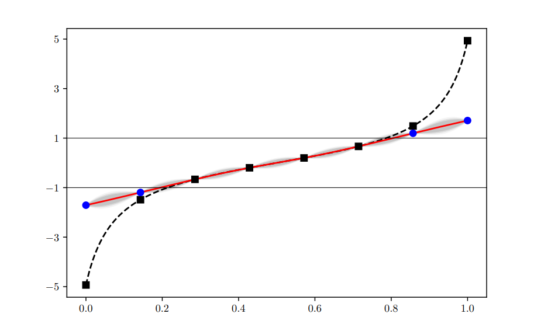

# regp_paper_experiments

This repository contains the scripts used for the numerical benchmarks of the article:

Sébastien J. Petit (§), Julien Bect (†), and Emmanuel Vazquez (†)
**Relaxed Gaussian Process Interpolation: a Goal-Oriented Approach to Bayesian Optimization**
([arXiv:2206.03034](https://arxiv.org/abs/2206.03034))

(§) Laboratoire National de Métrologie et d’Essais, 78197 Trappes Cedex, France.\
(†) Université Paris-Saclay, CNRS, CentraleSupélec,
[Laboratoire des signaux et systèmes](https://l2s.centralesupelec.fr/),
Gif-sur-Yvette, France.  

It relies on code available [here](https://github.com/relaxedGP/gpmp.git) and [here](https://github.com/relaxedGP/gpmp-contrib.git).



## Requirements

### Installation for Python

Use Python>=3.8.

```
## Create & activate virtual environnement
python3 -m venv regp
source ./regp/bin/activate

## Alternative: using conda
# conda create --prefix `pwd`/regp python=3.11
# source activate ./regp

## Install troch
pip3 install torch

## Install gmpm fork
git clone -b regp_paper_experiments https://github.com/relaxedGP/gpmp.git
pip3 install -e gpmp

## Install gpmp-contrib fork
git clone -b regp_paper_experiments https://github.com/relaxedGP/gpmp-contrib.git
pip3 install -e gpmp-contrib
```

### Reproducing the benchmarks

The numerical experiments for the three benchmarks from the article can be run using the script: `run/bench.py`.
The folder `results` must be created for the results to be stored.

#### Expected Improvement benchmark

The EGO algorithm and the three EGO-R variants introduced in the article can be run using the script: `run/bench.py`.
For running one repetition of the *concentration* heuristic on the *Goldstein-Price* function, one can use:
```
PYTHONPATH=utils SMC_METHOD=restart problem=goldsteinprice ALGO=EI STRATEGY=Concentration python3 -u run/bench.py
```
The two other reGP variants are run by setting `STRATEGY=Constant` and `STRATEGY=Spatial`.
The traditional EGO algorithm is run using by setting `STRATEGY=None`.

The file `optim_cases.txt` details the keywords for the other test functions from the article.

#### Upper Confidence Bounds (UCB) benchmark

For the UCB algorithm with a 10\%-quantile, the corresponding command is
```
PYTHONPATH=utils SMC_METHOD=subset problem=goldsteinprice ALGO=UCB10 STRATEGY=Concentration python3 -u run/bench.py
```
The same command can be used for the other keywords from the file `optim_cases.txt`. 
Other quantile levels can be used. For instance, the argument `ALGO=UCB1` stands for the UCB algorithm with a 1\% quantile.

#### Straddle benchmark

The straddle benchmark can be reproduced similarly. For the `c6` test function, run:
```
PYTHONPATH=utils problem=c6 ALGO=straddle STRATEGY=Concentration SMC_METHOD=subset ../PycharmProjects/gpmp/Scripts/python.exe -u run/bench.py
```
Use the same command for the `c67` test function.
The argument `problem=goldsteinprice-1000` can be used to run the straddle heuristic on the Goldstein-Price function with the threshold $`s = 1000`$.
The corresponding argument is `problem=goldstein_price_log-6.90775` for the log version.
The straddle heuristic can be run with other threshold values for the Goldstein-Price function and its log version.

##### Lauching using SLURM

The previous commands can be used to launch a single repetition of sequential design-of-experiments strategies.
Several repetitions can be launched in parallel using SLURM.
For instance, one can launch 100 repetitions of EGO-R with the concentration heuristic on the Goldstein-Price function
using:
```
bash run_method.sh results goldsteinprice Concentration 100 EI
```
The script `run_allmethods.sh` can be used to launch "None", "Concentration", "Constant", and "Spatial" in parallel:
```
bash run_allmethods.sh goldsteinprice 100 EI
```
Note that these bash scripts use the `python3` command.

### Plotting the results

The `.pgf` figures showing the results of the benchmarks can be reproduced using the scripts in `utils/analysis`.
Assume the results are stored in the `results` folder at the root of the repos and
`figures_path` is the folder where the `.pgf` files should be stored.
For EI and UCB, on can use:
```
cd utils/analysis
python3 -u plot_optim.py EI ../../results figures_path
```
For the straddle heuristic, one can run:
```
cd utils/analysis
python3 -u plot_levelset.py c6 ../../results figures_path
```
Run the same command for the other test functions.
